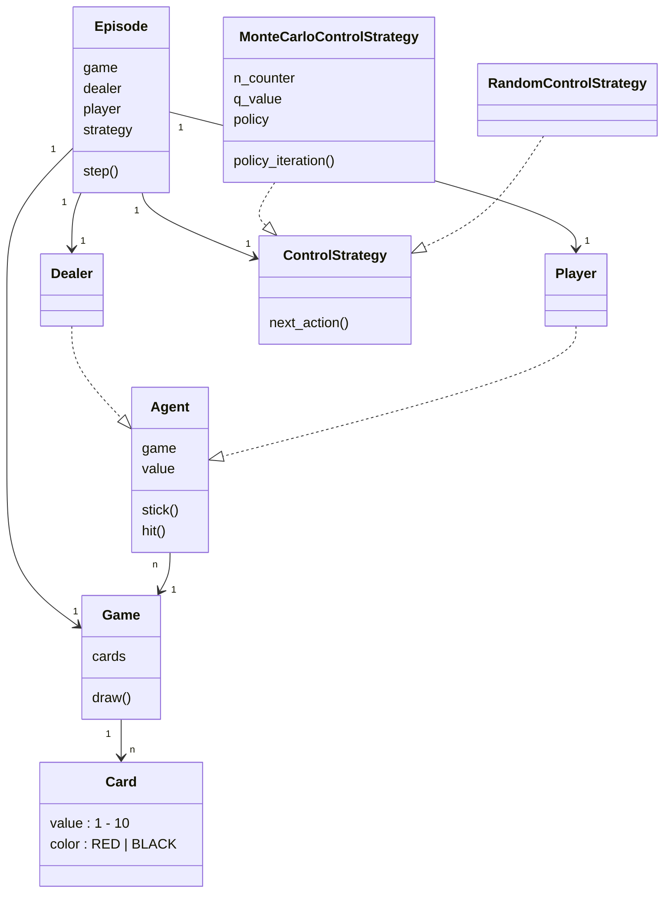

# Easy21

Project from David Silver's [Reinforcement Learning course @ UCL](https://davidstarsilver.wordpress.com/teaching/).

## Code Structure

## Monte Carlo Control

## TD Learning

## Linear Function Approximation
