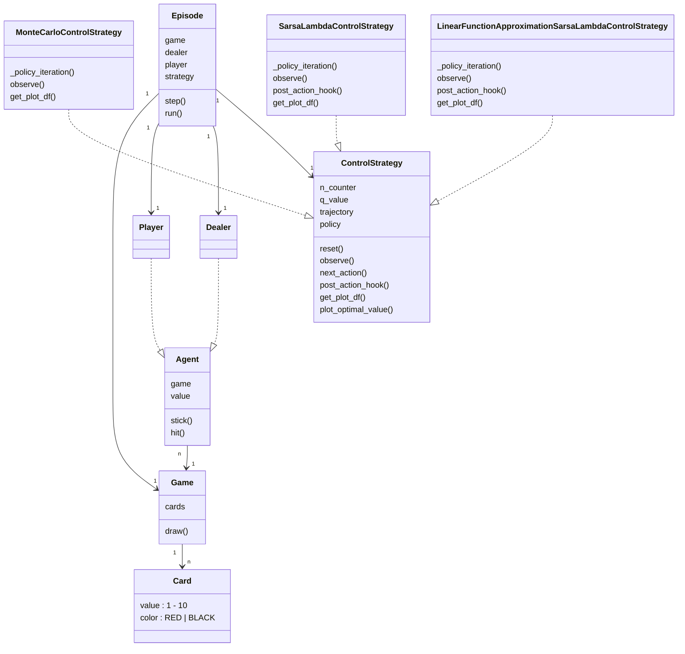
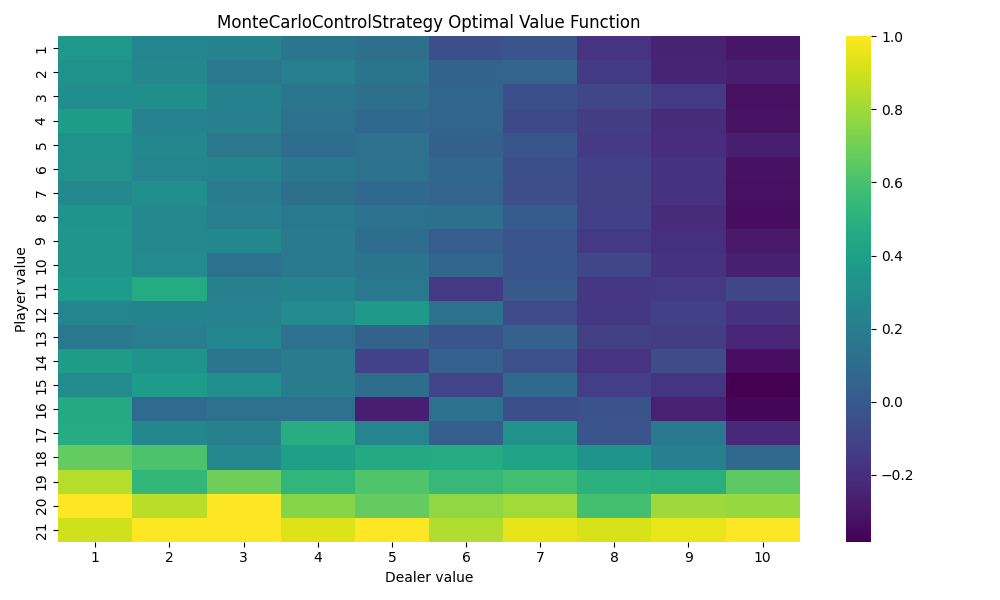
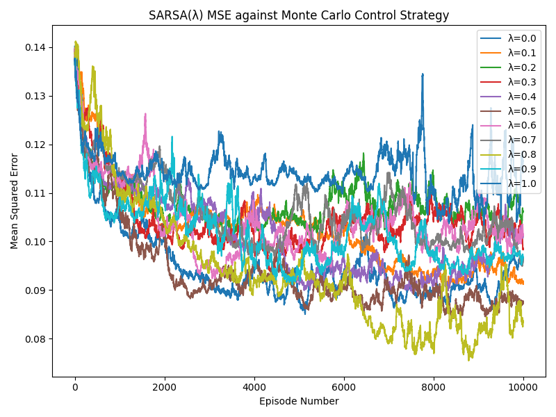
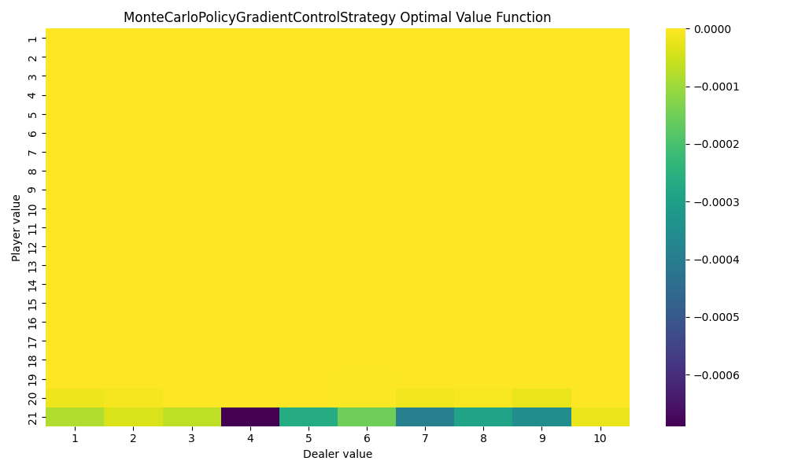
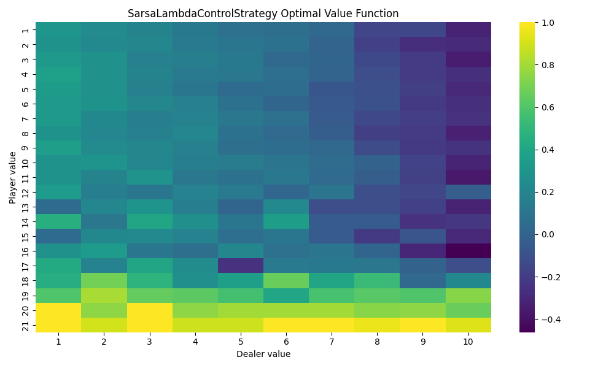

# Easy21

Project from David Silver's [Reinforcement Learning course @ UCL](https://davidstarsilver.wordpress.com/teaching/).

## Simulation

Run `episode_test.py` to kick start simulations using different control algorithms. Learned parameters will be persisted as `.pkl` files. Action-value functions are plotted as heatmaps and persisted as `.png` files.

Note that if a `.pkl` file already exists for certainnig control algorithm, test will reuse that instead of running a new one. Delete the `.pkl` file to trigger a new run.

```bash
# Run everything:
rm *.pkl & uv run pytest episode_test.py -s

# Run Monte Carlo control:
rm MonteCarloControlStrategy.pkl & uv run pytest episode_test.py::test_episode_monte_carlo_strategy -s

# Run Sarsa Lambda control:
rm SarsaLambdaControlStrategy.pkl & uv run pytest episode_test.py::test_episode_sarsa_lambda_strategy -s

# Run Sarsa Lambda control for MSE plot:
uv run pytest episode_test.py::test_mse_sarsa_lambda_strategy -s

# Run policy gradient REINFORCE algorithm:
rm MonteCarloPolicyGradientControlStrategy.pkl & uv run pytest episode_test.py::test_episode_monte_carlo_policy_gradient_strategy -s
```

## Code Structure



The `ControlStrategy` base class manages the common states and transition contracts across different kinds of strategies (e.g. MC, or TD-based Sarsa). It notably contains 4 state variables: `n`, which counts state/action pair visits, `q`, which defines action value function, `trajectory`, which records the currently active episodes running trajectory (this may be internally used by the policy iteration algorithm in MC or TD), and `policy`, which encapsulates a probability distribution of actions for any given state. This base class has 2 critical state transtion methods:
1. `observe(reward, next_state)`, which is invoked by the active episode each time an action `a[t+1]` happens at state `s[t]` which results in reward `r[t+1]` and transtion to next state `s[t+1]`. This method may be overridden by MC or Sarsa to apply additional behavior, such as policy iteration updates.
2. `next_action()`, this is a final non-overridable method, and simply outputs an action given the current state and current policy distribution.

## Monte Carlo Control

Command to reproduce:

```bash
rm MonteCarloControlStrategy.pkl & uv run pytest episode_test.py::test_episode_monte_carlo_strategy -s
```

See `control_strategy.MonteCarloControlStrategy`.



Note that dealer's value never exceeds 10, because dealer only draws once at start, then wait until player terminates, at which point whatever dealer does next will end up in terminal state. IOW, dealer value exceeds 10 only at terminal state, but the Q action-value function only evaluates on each (s_t, a_t, r_t) triplets, always excluding the final terminal state.

## TD Learning

Command to reproduce:

```bash
uv run pytest episode_test.py::test_mse_sarsa_lambda_strategy -s
```

See `control_strategy.SarsaLambdaControlStrategy`. A quick implementation note to call out: despite the algorithm is named `SARSA`, in practice when agent starts at state S and takes action A, it gets immediate feedbacks for both R and S *in parallel*, and in implementation, the `strategy` and `environment` only communicates by having the environment `episode` invoking `strategy.next_action()`, and rely on `strategy` to internally call back the `post_action_hook()` to collect rewards, then the `episode` environment transitions to next state (they can be reasoned to happen in paralle, though the program itself is single-threaded). This means if stragety tells episode to take action a at time t and that leads to terminal state, the hook invoked at time t won't know whether the new state is terminal yet, and therefore will still see immediate reward of 0. Then, at t+1, we do have a non-zero state, but that's only attributed to the terminal state at t+1. If we don't take another action at time t+1, `post_action_hook()` won't be triggered again, and that will make the action value fuction always evaluate to 0 for all state-action pairs. Thus, in `Episode.run()`, we always invoke `strategy.next_action()` one last time to collect the final reward.

To compute the MSE, we use the 100000-episodes results from Monte Carlo control as the ground truth, due to (a) Bellman optimality operator's contraction property, and (b) stocastic approximation convergence between MC and TD (both form Robbins-Monro sequence and satisfies GLIE property, as per slide 23 in https://davidstarsilver.wordpress.com/wp-content/uploads/2025/04/lecture-5-model-free-control-.pdf). Note that the eligibility trace does NOT carry over to new episodes, so by the time TD strategy reaches a terminal state, the eligibility trace must be reinitialized. This is because eligibility trace puts a blame on the current encountered states trajectory to adjust the final reward, so it's tied to per-episode trajectory.

Results are as follows:


MSE initially increases, likely because unexplored initial states all have zero action-values, leading to initially high bias errors. But over more episodes the errors drop down.

Finally, we could also plot the *final* MSE for each λ:


## Linear Function Approximation with  Sarsa(λ)

Command to reproduce (same as Sarsa(λ), because we use parametrized pytest so the same target covers both):

```bash
uv run pytest episode_test.py::test_mse_sarsa_lambda_strategy -s
```

See `control_strategy.LinearFunctionApproximationSarsaLambdaControlStrategy`.

Key implementation notes:
1. Function approximation requires some companion estimator from tabular methods, but instead of physially materializing the action value table, we can use function approximation to estimate its value. IOW, the dependency is both ways, with different time step to break cycle: (1) function approximation invokes companion's total reward formula using its current weights to help estimate that total reward, then (2) inference total reward using its own weight without seeing the immediate reward. Then the diff (a scalar) is the error and can be used to define how far to descend in gradient.
2. For native Sarsa(λ), eligibility trace is a matrix of state-action pairs mapping to some trace value. For function approximation with  Sarsa(λ), since we cannot materialize the table, we will use the weight vector's vector space (aka feature vector space) to track eligibility.




Function approximation appears to perform better initially, but worse in the long run, when comparing against the tabular method. This is expected because tabular methods initially don't explore much, so most estimates are zero, whereas function approximation has better generalizations initially, which gave better estimates initially even for unvisited states. But as we get more episodes, tabular methods visit more states and their estimates are more accuate.

It appears always doing random policy without policy improvement during policy iteration actually converges faster for TD-based tabular and function approximation methods for initial iterations. One hypothesis is that initial TD errors have higher bias and therefore random policies might give more exploration than exploitation. But as we gather more episodes we do expect random policy error to stop improving and perform worse than policy improvement strategies.

## Policy Gradient methods

`Policy` class is further subclassed into `ValuedBasedPolicy` and `PolicyGradientPolicy`. The latter takes responsibility of learning parameters directly for the policy. `ControlStrategy` implementations may opt to impelment policy gradient famliy of algorithms, in which case the dependency in policy can be `PolicyGradientPolicy` instead of `ValuedBasedPolicy`. See `MonteCarloPolicyGradientControlStrategy` for example. Simulation results (note 0 means HIT, 1 means STICK):



## Deepmind RL Environment API Integration

See `dm_env_adapter.py` for integration with the [Deepmind RL environment API](https://github.com/google-deepmind/dm_env). Notable learnings:

* Client needs to implement a subclass of `dm_env.Environment`, notably overriding 4 methods: `reset`, `step`, `observation_spec`, and `action_spec`.
* The `*_spec` overrides define the data model for state and action, respectively.
* Once the specs are defined, `reset` and `step` are a matter of invoking already-implemented `Episode` and `ControlStrategy` instances.
* One additional logic is to translate internals of `Episode` and `ControlStrategy` into a canonical DTO called `dm_env.TimeStep`, which is a named tuple consisting of `step_type`, `reward`, `discount`, `observation`. See https://github.com/google-deepmind/dm_env/blob/master/docs/index.md for full documentation.
* `dm_env` module provides static helpers to transition and terminate throughout the episode.

Action-values learned after 100000 episodes (λ=0.5 for TD-based methods):





Similar to earlier findings, fuction approximation method typically performs worse.
