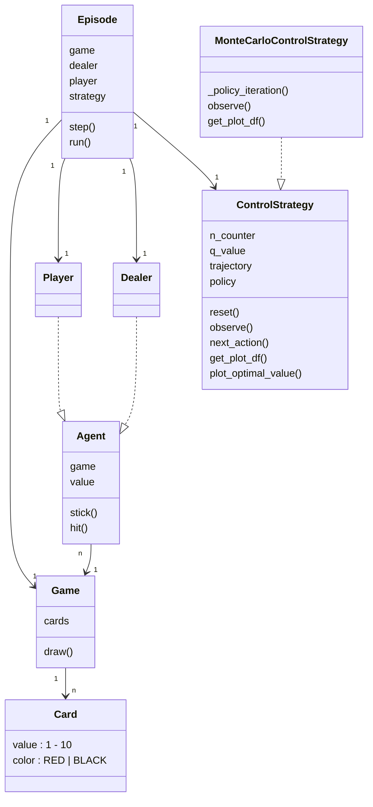
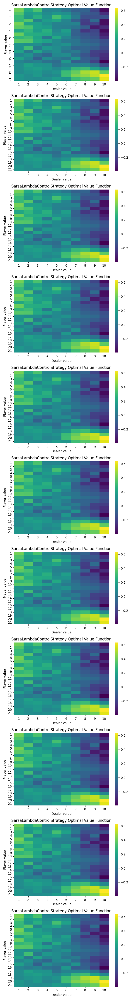
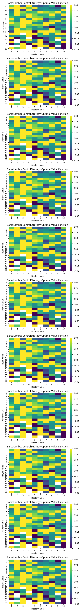

# Easy21

Project from David Silver's [Reinforcement Learning course @ UCL](https://davidstarsilver.wordpress.com/teaching/).

## Simulation

Run `episode_test.py` to kick start simulations using different control algorithms. Learned parameters will be persisted as `.pkl` files. Action-value functions are plotted as heatmaps and persisted as `.png` files.

Note that if a `.pkl` file already exists for certainnig control algorithm, test will reuse that instead of running a new one. Delete the `.pkl` file to trigger a new run.

```bash
# Run everything:
rm *.pkl & uv run pytest episode_test.py -s

# Run Monte Carlo control:
rm MonteCarloControlStrategy.pkl & uv run pytest episode_test.py::test_episode_monte_carlo_strategy -s

# Run Sarsa Lambda control:
rm SarsaLambdaControlStrategy.pkl & uv run pytest episode_test.py::test_episode_sarsa_lambda_strategy -s
```

## Code Structure



The `ControlStrategy` base class manages the common states and transition contracts across different kinds of strategies (e.g. MC, or TD-based Sarsa). It notably contains 4 state variables: `n`, which counts state/action pair visits, `q`, which defines action value function, `trajectory`, which records the currently active episodes running trajectory (this may be internally used by the policy iteration algorithm in MC or TD), and `policy`, which encapsulates a probability distribution of actions for any given state. This base class has 2 critical state transtion methods:
1. `observe(reward, next_state)`, which is invoked by the active episode each time an action `a[t+1]` happens at state `s[t]` which results in reward `r[t+1]` and transtion to next state `s[t+1]`. This method may be overridden by MC or Sarsa to apply additional behavior, such as policy iteration updates.
2. `next_action()`, this is a final non-overridable method, and simply outputs an action given the current state and current policy distribution.

## Monte Carlo Control

See `control_strategy.MonteCarloControlStrategy`.


Note that dealer's value never exceeds 10, because dealer only draws once at start, then wait until player terminates, at which point whatever dealer does next will end up in terminal state. IOW, dealer value exceeds 10 only at terminal state, but the Q action-value function only evaluates on each (s_t, a_t, r_t) triplets, always excluding the final terminal state.

## TD Learning

See `control_strategy.SarsaLambdaControlStrategy`. A quick implementation note to call out: despite the algorithm is named `SARSA`, in practice when agent starts at state S and takes action A, it gets immediate feedbacks for both R and S *in parallel*, and in implementation, the `strategy` and `environment` only communicates by having the environment `episode` invoking `strategy.next_action()`, and rely on `strategy` to internally call back the `post_action_hook()` to collect rewards, then the `episode` environment transitions to next state (they can be reasoned to happen in paralle, though the program itself is single-threaded). This means if stragety tells episode to take action a at time t and that leads to terminal state, the hook invoked at time t won't know whether the new state is terminal yet, and therefore will still see immediate reward of 0. Then, at t+1, we do have a non-zero state, but that's only attributed to the terminal state at t+1. If we don't take another action at time t+1, `post_action_hook()` won't be triggered again, and that will make the action value fuction always evaluate to 0 for all state-action pairs. Thus, in `Episode.run()`, we always invoke `strategy.next_action()` one last time to collect the final reward.

With 100000 episodes (same as Monte Carlo):


With 1000 episodes:


Results are notably higher. This is expected, because TD-based methods are generally higher bias and lower variance, though with enough iterations is expected to converge to the same optimal policy as Monte Carlo based methods.

## Linear Function Approximation
