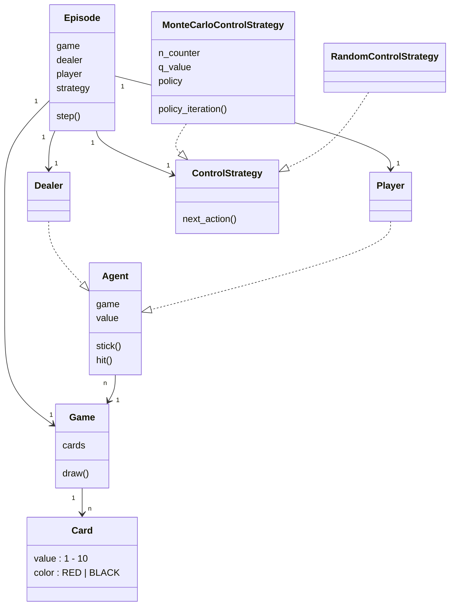
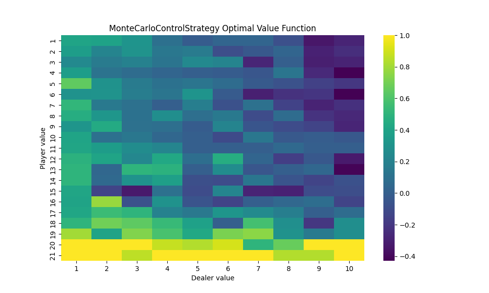

# Easy21

Project from David Silver's [Reinforcement Learning course @ UCL](https://davidstarsilver.wordpress.com/teaching/).

## Simulation

Run `episode_test.py` to kick start simulations using different control algorithms. Learned parameters will be persisted as `.pkl` files. Action-value functions are plotted as heatmaps and persisted as `.png` files.

Note that if a `.pkl` file already exists for certainnig control algorithm, test will reuse that instead of running a new one. Delete the `.pkl` file to trigger a new run.

```bash
# Run everything:
uv run pytest episode_test.py -s

# Run Monte Carlo control:
uv run pytest episode_test.py::test_episode_monte_carlo_strategy -s
```

## Code Structure



## Monte Carlo Control

See `control_strategy.MonteCarloControlStrategy`.



Note that dealer's value never exceeds 10, because dealer only draws once at start, then wait until player terminates, at which point whatever dealer does next will end up in terminal state. IOW, dealer value exceeds 10 only at terminal state, but the Q action-value function only evaluates on each (s_t, a_t, r_t) triplets, always excluding the final terminal state.

## TD Learning

## Linear Function Approximation
